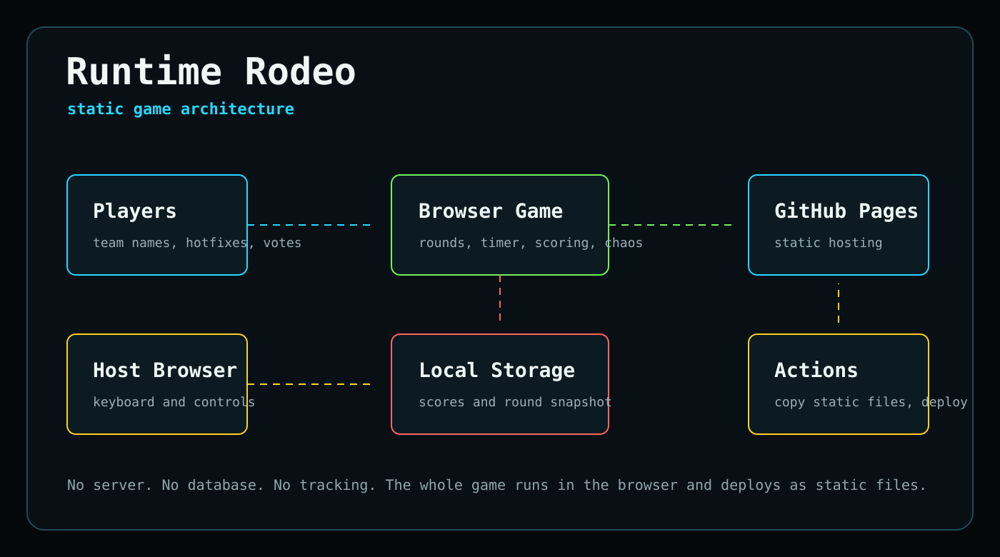

# Runtime Rodeo


Runtime Rodeo is a browser-based developer party game about surviving absurd production incidents, agent mishaps, flaky deploys, tool-call disasters, and suspiciously confident hotfixes.

Live site: <https://yashrajnayak.com/runtime-rodeo/>

## How It Plays

Reveal an incident, start the timer, and let teams pitch the funniest survivable fix. There are no trivia answers to memorize: the host awards points for the most convincing, chaotic, or beautifully cursed explanation.

- Click **Next round** or press `N` to reveal a new incident.
- Click a tool card to mutate uptime, pressure, and chaos.
- Select a team, then click **Score** or press `1`-`4`.
- Use **Sabotage** when the room is getting too comfortable.
- Use **Panic mode** when the incident deserves theater.

## Architecture



Runtime Rodeo is a static browser app. GitHub Actions packages the static files and publishes them to GitHub Pages. The browser owns gameplay state, timer controls, team scores, and local persistence.

## Local Development

```bash
npm install
npm run dev
```

Validate the static files:

```bash
npm run build
```

Preview locally:

```bash
npm run preview
```

## Deployment

Pushes to `main` deploy through `.github/workflows/pages.yml`.

The site is packaged from `index.html`, `src/`, and `assets/`.

## Keyboard Shortcuts

| Key | Action |
| --- | --- |
| `Space` | Start or pause timer |
| `N` | Next round |
| `1`-`4` | Award points to a team |
| `X` | Trigger sabotage |
| `P` | Toggle panic mode |
| `R` | Show rules |

## License

MIT
